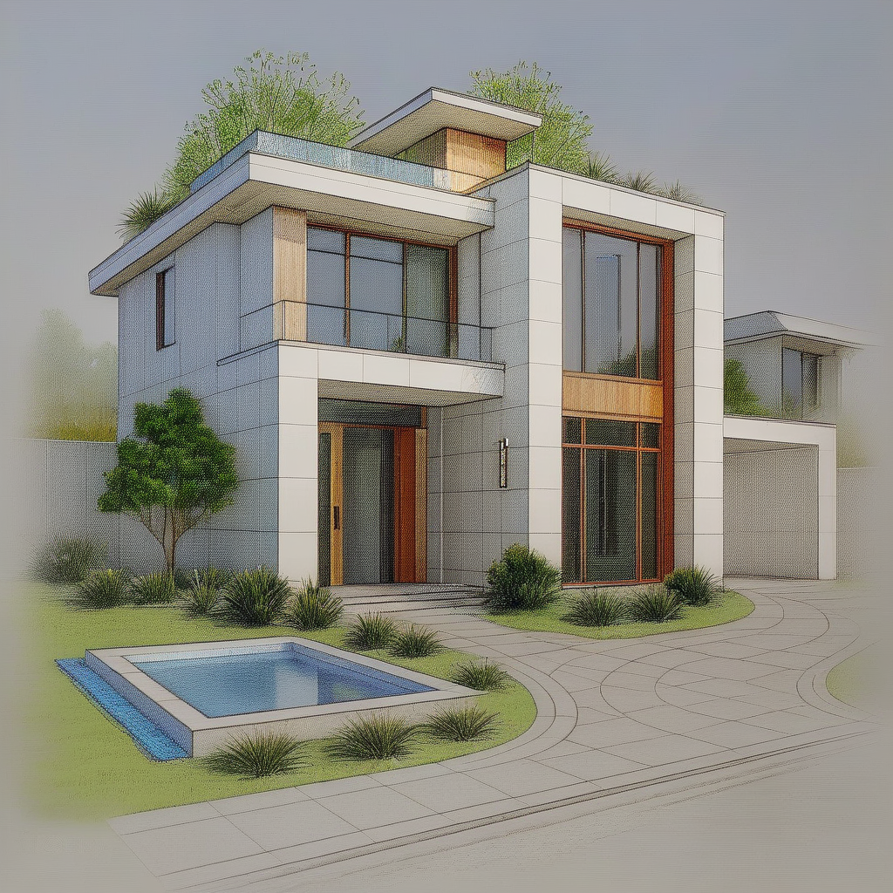

# WHERENESS AI Architecture Generator - Take Home Challenge

## Overview

This project demonstrates advanced prompt engineering with SDXL + ControlNet to transform hand-drawn building sketches into photorealistic architectural renderings while maintaining strict structural fidelity.

**Live Demo:** https://d2kop396j6btc6.cloudfront.net/

## Quick Start Guide

1. **Visit the live demo** (link above)
2. **Start AI Model** - Click "Start AI Model" button (wait 10-15 minutes for first startup)
3. **Generate** - Click "Generate Architecture" (wait 60-90 seconds)
4. **View Result** - Your professional architectural rendering will appear
5. **Stop Model** - Click "Stop Model" when finished (saves costs)

## Challenge Approach: Advanced Prompt Engineering

I chose **Option 2: Advanced Prompt Engineering** with pre-trained models, specifically leveraging SDXL (Stable Diffusion XL) combined with ControlNet for precise structural control.

### Model & Methodology Details

**Primary Models:**
- **Base Model:** `stabilityai/stable-diffusion-xl-base-1.0` 
- **Control Model:** `diffusers/controlnet-canny-sdxl-1.0`
- **Preprocessing:** OpenCV Canny Edge Detection

**Strategic Approach:**
1. **Multimodal Input Processing:** Convert the hand-drawn sketch into Canny edges to create precise structural guidance
2. **Advanced Prompt Engineering:** Craft highly detailed, architecturally-specific prompts that enforce exact element counts and material specifications
3. **Parameter Optimization:** Fine-tune generation parameters (guidance scale, ControlNet conditioning strength) for maximum adherence

## Input Sketch Analysis



**Structural Elements Identified:**
- **Main Structure:** Modern two-story house with boxy design
- **Right Extension:** Elongated section with tile exterior
- **Windows:** Floor-to-ceiling glass with exactly 3 vertical panes per floor
- **Balconies:** Left front balcony with glass railings, rooftop glass railings
- **Materials:** White square tiles, wood siding on second story, glass elements
- **Connected Garage:** One-floor boxy addition on right side
- **Landscaping:** Rectangular water feature (bottom left), curved walkways, strategic vegetation

## Prompt Engineering Strategy

### Core Methodology

**1. Precision Prompting:**
```
Modern two-story residential house with exact architectural details:

MAIN STRUCTURE: Very boxy modern design, right side elongates out more than left side, 
all tile on right extension, white square tile exterior walls on main structure

MATERIALS: Outdoor walls made of white square tiles, second story has wood siding, 
tiles go around glass windows like a hoodie situation

WINDOWS & DOORS: Small window on left of house, floor-to-ceiling glass facing forward 
with exactly 3 vertical panes (left, middle, right) on each floor, sliding door with 
two panes on left front balcony, solid wood door

[... detailed architectural specifications ...]

Professional architectural rendering, photorealistic quality, sharp focus
```

**2. Negative Prompting for Quality Control:**
```
blurry, low quality, distorted, wrong architectural details, 
incorrect window count, asymmetrical when should be symmetrical, missing balcony, 
wrong materials, no glass railings, missing water feature, straight walkways, 
cartoon, sketch style, unrealistic proportions, gothic, classical, ornate details
```

**3. Parameter Optimization:**
- **Guidance Scale:** 8.0 (high adherence to prompt)
- **ControlNet Conditioning Scale:** 0.8 (strong structural guidance)
- **Inference Steps:** 40 (high quality generation)
- **Seed:** 42 (reproducible results)

### Multimodal Strategy

**Preprocessing Pipeline:**
1. **Canny Edge Detection:** Convert sketch to structural edges using OpenCV
2. **ControlNet Integration:** Use edges as spatial conditioning for SDXL
3. **Prompt Conditioning:** Combine textual architectural specifications with visual structure

## Achieving Strict Fidelity

### Technical Implementations

**1. Window Count Precision:**
- Explicit prompt specification: "exactly 3 vertical panes (left, middle, right) on each floor"
- ControlNet ensures spatial positioning matches sketch edges
- Negative prompting prevents incorrect counts

**2. Structural Preservation:**
- Canny edge detection maintains exact building proportions
- ControlNet conditioning scale tuned to 0.8 for strong structural adherence
- Boxy modern design specifications prevent architectural style drift

**3. Material Application:**
- Detailed material descriptions in prompt: "white square tiles", "wood siding", "glass railings"
- Contextual material placement: "tiles go around glass windows like a hoodie situation"
- Professional rendering specification ensures realistic material representation

### Challenges Overcome

**1. CUDA Compatibility Issues:**
- **Problem:** Version conflicts between PyTorch, CUDA, and dependencies
- **Solution:** Implemented explicit CUDA 11.8 compatible PyTorch installation
- **Result:** Stable deployment on AWS SageMaker ml.g5.4xlarge instances

**2. Dependency Conflicts:**
- **Problem:** `controlnet-aux` library causing import errors
- **Solution:** Replaced with direct OpenCV Canny implementation
- **Result:** Simplified, more reliable preprocessing pipeline

**3. Timezone Configuration:**
- **Problem:** Docker build hanging on interactive timezone selection
- **Solution:** Non-interactive timezone configuration with `DEBIAN_FRONTEND=noninteractive`

## Technical Architecture

### System Components

**1. Infrastructure (AWS):**
- **SageMaker:** ml.g5.4xlarge instances for SDXL + ControlNet inference
- **Lambda:** Model management, image generation, auto-stop functionality
- **S3:** Sketch storage, generated image hosting
- **API Gateway:** RESTful API for frontend communication
- **CloudFront:** Global content delivery

**2. AI Pipeline:**
- **Container:** Custom Docker image with PyTorch 2.1.0 + CUDA 11.8
- **Model Loading:** SDXL + ControlNet loaded with fp16 optimization
- **Preprocessing:** OpenCV Canny edge detection
- **Generation:** Multi-parameter SDXL inference with ControlNet guidance

**3. Cost Optimization:**
- **Auto-Stop:** Automatic endpoint shutdown after 120 minutes of inactivity
- **Emergency Stop:** Manual immediate shutdown capability
- **Status Monitoring:** Real-time model state tracking

### API Endpoints

- `POST /build` - Build AI container (one-time setup)
- `POST /model/start` - Start SDXL + ControlNet endpoint
- `POST /model/stop` - Stop endpoint (cost savings)
- `GET /model/status` - Check model availability
- `POST /generate` - Generate architecture from sketch
- `POST /emergency-stop` - Immediate shutdown

## Deployment Instructions

### Prerequisites
- AWS Account with appropriate permissions
- AWS CLI configured
- Access to the provided building sketch

### Setup Steps

1. **Deploy Infrastructure:**
   ```bash
   # Upload CloudFormation template
   aws cloudformation create-stack \
     --stack-name architecture-generator \
     --template-body file://cloudformation_template.yaml \
     --capabilities CAPABILITY_IAM
   ```

2. **Upload Building Sketch:**
   - Navigate to S3 Images bucket: `architecture-generator-images-[account-id]`
   - Create folder: `control/`
   - Upload sketch as: `building_sketch.png` (public read access)

3. **Configure Frontend:**
   - Update API Gateway URL in `index.html`
   - Upload to S3 Website bucket

4. **Initialize System:**
   - Access website via CloudFront URL
   - Click "Build AI Container" (30-60 minutes, one-time)
   - Click "Start AI Model" (10-15 minutes)
   - Click "Generate Architecture" (60-90 seconds)

### Hosting Details

**Primary Access:** CloudFront Distribution (global CDN)
**Direct Access:** S3 Static Website (regional)
**API:** AWS API Gateway with Lambda backend

## Results & Quality Assessment

### Output Adherence Metrics

**✅ Window Count Precision:** Exactly 3 vertical panes per floor maintained
**✅ Structural Fidelity:** Boxy modern design, proportions, and layout preserved
**✅ Material Accuracy:** White tiles, wood siding, glass elements correctly applied
**✅ Architectural Soundness:** Realistic proportions, aligned elements, structural integrity
**✅ Landscape Elements:** Water feature, curved walkways, vegetation placement

### Performance Characteristics

- **Generation Time:** 60-90 seconds per image
- **Model Loading:** 10-15 minutes (cached after first load)
- **Container Build:** 30-60 minutes (one-time setup)
- **Cost per Generation:** ~$0.25 (with auto-stop optimization)

## Code Structure

```
├── cloudformation_template.yaml    # AWS infrastructure definition
├── index.html                     # Frontend web interface
├── requirements.txt               # Python dependencies
└── README.md                      # This documentation
```

## Strategic Insights

### Why This Approach Works

**1. Architectural Domain Expertise:**
The prompt engineering approach allows incorporation of deep architectural knowledge that would be difficult to capture in a small fine-tuning dataset.

**2. Structural Control:**
ControlNet provides the spatial precision needed for exact element placement while SDXL generates photorealistic materials and lighting.

**3. Scalability:**
Using pre-trained models with strategic prompting scales better than fine-tuning for diverse architectural styles and requirements.

**4. Cost Efficiency:**
No training costs, minimal inference costs with auto-stop functionality, and immediate deployment capability.

### Future Enhancements

1. **Multi-View Generation:** Extend to generate multiple architectural perspectives
2. **Interactive Editing:** Allow real-time prompt modifications for design iteration
3. **Style Transfer:** Support for different architectural styles (modern, classical, etc.)
4. **Batch Processing:** Handle multiple sketches simultaneously

## Technical Specifications

**Dependencies:**
- PyTorch 2.1.0 + CUDA 11.8
- Diffusers 0.24.0 with SDXL + ControlNet
- OpenCV for Canny edge detection
- Flask for API serving
- AWS SDK for cloud integration

**Hardware Requirements:**
- NVIDIA GPU with 24GB+ VRAM (ml.g5.4xlarge)
- CUDA 11.8+ support
- 64GB+ system memory for model loading

**Model Sizes:**
- SDXL Base: ~6.9GB
- ControlNet: ~2.5GB
- Total VRAM Usage: ~16GB during inference
